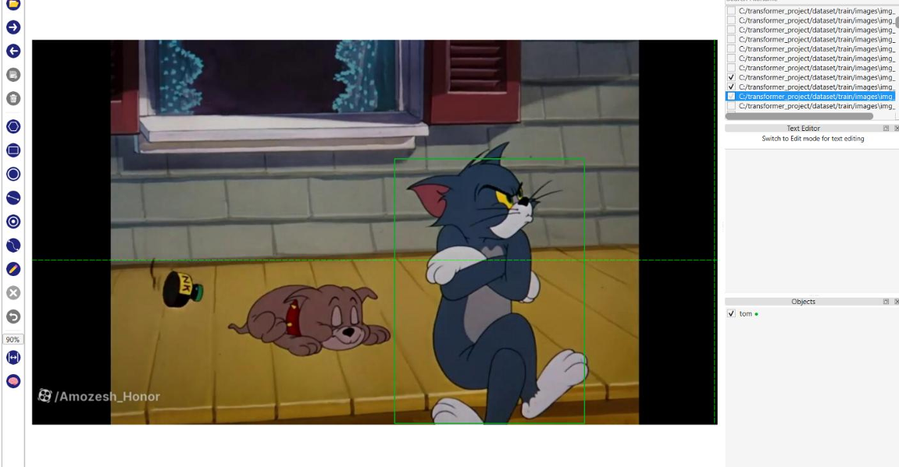
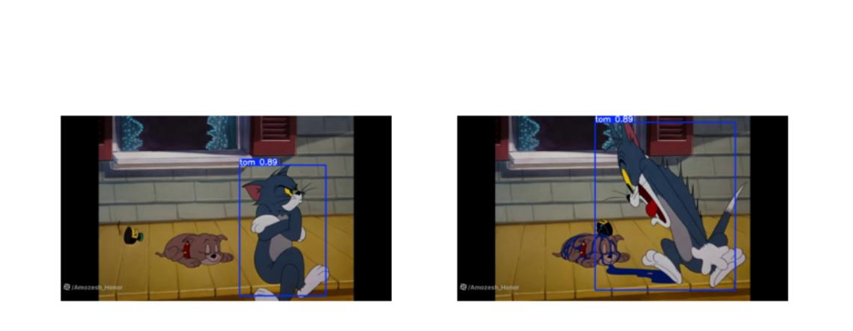

حتماً. حالا که دو تصویر را هم به Repository اضافه کرده‌ای، README را طوری تنظیم می‌کنیم که **هم مرحله‌ی Annotation در AnyLabeling و هم خروجی نهایی YOLOv8** را نشان دهد. همچنین متن را با پروژه‌ی واقعی تو هماهنگ می‌کنم؛ یعنی **Tom Object Detection**، نه Face Recognition.

این نسخه را می‌توانی مستقیماً داخل `README.md` قرار بدهی:

# Tom Detection Using YOLOv8

## 📌 Project Overview

This project implements a **single-class object detection system using YOLOv8** to detect the character **Tom** from a Tom & Jerry video.

The main goal of the project is to extract frames from a video, prepare and annotate the dataset, train a YOLOv8 model, evaluate its performance, and detect Tom in unseen images.

The complete workflow includes:

1. Extracting frames from the input video
2. Preparing the dataset
3. Annotating images using **AnyLabeling**
4. Converting annotations to YOLO format
5. Splitting the dataset into training and validation sets
6. Training a YOLOv8 model
7. Evaluating the trained model
8. Visualizing the model predictions

---

## 🎯 Objectives

The main objectives of this project are:

* Extract frames from a Tom & Jerry video.
* Create a dataset for object detection.
* Manually annotate Tom using bounding boxes.
* Convert annotations into YOLO format.
* Train a YOLOv8 model for single-class object detection.
* Evaluate the trained model using standard object detection metrics.
* Visualize the detection results.
* Analyze the performance of the trained model.

---

## 🧩 Problem Statement

The task is to detect the character **Tom** in different frames extracted from a Tom & Jerry video.

For each input image, the model should determine whether Tom is present and, if detected, identify his exact location using a **bounding box**.

The model should be able to detect Tom under different conditions, including changes in:

* Position
* Scale
* Background
* Pose
* Motion
* Scene composition

This project focuses on **object detection**, where the model predicts the location of Tom rather than simply classifying the entire image.

---

## 🛠️ Technologies and Tools

The main technologies used in this project are:

* **Python**
* **OpenCV**
* **YOLOv8**
* **Ultralytics**
* **AnyLabeling**
* **Pandas**
* **Matplotlib**
* **Jupyter Notebook**
* **Git & GitHub**

---

## 🤖 Model

The object detection model used in this project is **YOLOv8n**.

YOLO stands for **You Only Look Once** and is a real-time object detection architecture.

The `n` version refers to the nano model, which is a relatively lightweight version of YOLOv8.

The model was selected because it provides a practical balance between:

* Detection performance
* Training speed
* Computational requirements
* Model size

Only one object class was used in this project:

```text
Class ID: 0
Class Name: Tom
```

---

# 📂 Project Structure

The main files and directories of the repository are organized as follows:

```text
Face_Recognition_YOLOv8/
│
├── .gitignore
├── data.yaml
├── README.md
├── Tom_Detection_YOLOv8.ipynb
│
└── Images/
    ├── image1.png
    └── image2.png
```

### Files

**Tom_Detection_YOLOv8.ipynb**

Contains the complete Python workflow, including dataset preparation, annotation conversion, model training, validation, visualization, and prediction.

**data.yaml**

Contains the YOLO dataset configuration.

**README.md**

Provides an overview and documentation of the project.

**Images/**

Contains selected images demonstrating the annotation and final prediction stages.

---

# 🎥 Input Video

The dataset was created from a Tom & Jerry video.

Instead of directly training the model on the complete video, individual frames were extracted from the video.

Approximately **200 frames** were selected for creating the dataset.

The extracted images were then used for annotation and model training.

---

# 🖼️ Frame Extraction

OpenCV was used to read the input video and extract frames at regular intervals.

The extraction process was designed to obtain approximately 200 images from the video.

The extracted frames were saved as `.jpg` images.

The general workflow was:

```text
Input Video
     ↓
Read Video Frames
     ↓
Select Frames
     ↓
Save Images
     ↓
Create Dataset
```

---

# 🏷️ Data Annotation

The extracted images were manually annotated using **AnyLabeling**.

For each selected image, a bounding box was drawn around the character **Tom**.

Only one class was used:

```text
Tom
```

The annotation process identifies the exact location of Tom in each image.

### Annotation Example

The following image shows an example of the manual annotation process using AnyLabeling.



In this step, the bounding box is manually created around Tom.

The annotation information is then used as the ground truth for training the YOLOv8 model.

---

# 🔄 Annotation Conversion

AnyLabeling stores the annotations in JSON format, while YOLOv8 requires annotations in a specific TXT format.

Therefore, a Python script was used to convert the JSON annotations into YOLO format.

Each object is represented using:

```text
class_id x_center y_center width height
```

All bounding box coordinates are normalized between 0 and 1.

For example:

```text
0 0.52 0.47 0.31 0.55
```

where:

* `0` → class ID of Tom
* `0.52` → normalized x-coordinate of the bounding box center
* `0.47` → normalized y-coordinate of the bounding box center
* `0.31` → normalized bounding box width
* `0.55` → normalized bounding box height

---

# 📊 Dataset Structure

The dataset follows the standard YOLO directory structure:

```text
dataset/
│
├── train/
│   ├── images/
│   └── labels/
│
└── val/
    ├── images/
    └── labels/
```

The dataset was divided into:

* **80% training data**
* **20% validation data**

The training images were used to train the YOLOv8 model, while the validation images were used to evaluate its performance during the training process.

---

# ⚙️ Dataset Configuration

The YOLO dataset configuration was defined using a `data.yaml` file.

The dataset contains one class:

```yaml
nc: 1
names: ['Tom']
```

The dataset paths are also specified in this file.

---

# 🧠 Model Training

The YOLOv8 Nano model was used for training:

```python
from ultralytics import YOLO

model = YOLO("yolov8n.pt")
```

The model was trained using the following configuration:

| Parameter         |     Value |
| ----------------- | --------: |
| Model             |   YOLOv8n |
| Number of Classes |         1 |
| Class             |       Tom |
| Epochs            |        50 |
| Image Size        | 640 × 640 |
| Batch Size        |         8 |

The training process was performed using the training dataset and evaluated using the validation dataset.

---

# 📈 Evaluation Metrics

Several metrics were used to evaluate the trained object detection model.

## Loss

Loss represents the error made by the model during training.

The training and validation losses were monitored throughout the training process.

The main loss components include the bounding box regression loss and other YOLO training losses.

A decreasing training loss generally indicates that the model is learning from the training data.

---

## Precision

Precision measures how many of the objects detected by the model are actually correct.

In this project:

```text
Precision = 0.9237
```

This means that the model's detections had a precision of approximately **92.37%** under the evaluated validation conditions.

---

## Recall

Recall measures how many of the actual target objects were successfully detected by the model.

The obtained recall was:

```text
Recall = 0.8947
```

This corresponds to approximately **89.47% recall** on the evaluated validation data.

---

## mAP@50

Mean Average Precision at IoU threshold 0.50 is a common object detection evaluation metric.

The obtained result was:

```text
mAP50 = 0.9066
```

Therefore, the model achieved approximately **90.66% mAP@50** on the validation dataset.

---

## mAP@50-95

The model also achieved:

```text
mAP50-95 = 0.4790
```

mAP@50-95 evaluates the model across multiple IoU thresholds from 0.50 to 0.95.

Because this metric uses stricter localization requirements, its value is generally lower than mAP@50.

---

# 📉 Loss Curve

The training and validation loss values were recorded during the 50 training epochs.

The loss curve can be used to observe the learning behavior of the model and compare the training and validation performance.

```text
Training
    ↓
Loss values recorded
    ↓
Visualization
    ↓
Analysis of model learning
```

---

# 📊 Precision and Recall Curve

Precision and recall were monitored during training and validation.

The final values obtained were:

| Metric    |  Value |
| --------- | -----: |
| Precision | 0.9237 |
| Recall    | 0.8947 |

These values indicate that the trained model was able to detect Tom in most of the evaluated validation images while maintaining a relatively low number of incorrect detections.

---

# 📈 mAP Curve

The mAP metric was also monitored to evaluate the object detection performance.

The final values were:

| Metric   |  Value |
| -------- | -----: |
| mAP50    | 0.9066 |
| mAP50-95 | 0.4790 |

The difference between mAP50 and mAP50-95 reflects the stricter localization requirements used by the latter metric.

---

# 🧮 Confusion Matrix

A confusion matrix was generated during model evaluation.

The evaluated results included:

* **18 correctly detected Tom instances**
* **1 Tom instance incorrectly classified as background**
* **2 background instances incorrectly detected as Tom**

The confusion matrix provides additional information about correct detections and detection errors.

---

# 🖼️ Prediction Results

After training, the YOLOv8 model was used to perform object detection on validation images.

The model predicts a bounding box around Tom when the character is detected.

The following image shows an example of the final YOLOv8 prediction.



In this example, the model successfully identifies Tom and places a bounding box around the detected character.

---

# 📋 Final Results

The final evaluation results are summarized below:

| Metric                | Result |
| --------------------- | -----: |
| Precision             | 0.9237 |
| Recall                | 0.8947 |
| mAP50                 | 0.9066 |
| mAP50-95              | 0.4790 |
| Final Train Loss      | 0.8053 |
| Final Validation Loss | 1.8320 |

---

# 🔍 Results Analysis

The obtained results show that the trained YOLOv8 model was able to detect Tom in the validation images.

The model achieved a precision of **92.37%** and recall of **89.47%**.

The mAP50 value of **90.66%** indicates good detection performance under the IoU threshold of 0.50.

However, the mAP50-95 value was lower at **47.90%**. This difference indicates that while the model can often detect Tom correctly, the predicted bounding boxes may not always have highly precise localization when evaluated using stricter IoU thresholds.

The validation loss was also higher than the final training loss:

```text
Training Loss:   0.8053
Validation Loss: 1.8320
```

This difference should be considered when interpreting the generalization of the model to unseen images.

---

# ⚠️ Limitations

Several limitations exist in this project.

### 1. Small Dataset

The dataset contains approximately 200 extracted frames.

A larger and more diverse dataset could provide the model with more examples of Tom under different conditions.

### 2. Single Character

Only Tom was annotated and detected.

Jerry and other objects were not included as detection classes.

### 3. Similar Video Frames

Since the images were extracted from the same video, consecutive frames can have similar visual content.

This can reduce the diversity of the dataset.

### 4. Bounding Box Localization

The mAP50-95 result is considerably lower than mAP50, suggesting that more precise bounding-box localization could be improved.

### 5. Limited Generalization

The model was trained on frames from a particular Tom & Jerry video.

Therefore, its performance on other episodes, animation styles, resolutions, or significantly different scenes may differ.

---

# 🚀 Possible Improvements

The project could be improved in several ways.

### Larger Dataset

More frames could be collected from different Tom & Jerry scenes and episodes.

### More Diverse Data

Images containing different poses, scales, backgrounds, and partial occlusions could be included.

### More Precise Annotation

More accurate bounding boxes could improve localization performance.

### Data Augmentation

Techniques such as:

* Rotation
* Scaling
* Cropping
* Flipping
* Brightness adjustment

could be used to increase data diversity.

### Hyperparameter Optimization

Training parameters such as:

* Learning rate
* Batch size
* Number of epochs
* Image size

could be optimized.

### Larger YOLO Models

Other YOLOv8 model sizes such as YOLOv8s, YOLOv8m, or YOLOv8l could be evaluated and compared with YOLOv8n.

---

# ▶️ How to Run

## 1. Install Dependencies

Install the required packages:

```bash
pip install ultralytics
pip install opencv-python
pip install pandas
pip install matplotlib
```

## 2. Open the Notebook

Open:

```text
Tom_Detection_YOLOv8.ipynb
```

using Jupyter Notebook or JupyterLab.

## 3. Prepare the Dataset

Create the required dataset structure:

```text
dataset/
├── train/
│   ├── images/
│   └── labels/
└── val/
    ├── images/
    └── labels/
```

## 4. Configure the Dataset

Update the paths in:

```text
data.yaml
```

## 5. Train the Model

Run the YOLOv8 training cells in the notebook.

The training configuration used in this project is:

```python
model.train(
    data="data.yaml",
    epochs=50,
    imgsz=640,
    batch=8
)
```

## 6. Evaluate the Model

Run the validation section to calculate:

* Precision
* Recall
* mAP50
* mAP50-95

## 7. Generate Predictions

The trained model can then be used to detect Tom in new images.

---

# 🔄 Complete Project Workflow

The complete workflow can be summarized as:

```text
Tom & Jerry Video
        ↓
Frame Extraction
        ↓
Dataset Creation
        ↓
Manual Annotation with AnyLabeling
        ↓
JSON Annotations
        ↓
Conversion to YOLO TXT Format
        ↓
Train / Validation Split
        ↓
YOLOv8n Training
        ↓
Model Validation
        ↓
Metrics Calculation
        ↓
Prediction
        ↓
Bounding Box around Tom
```

---

# 📌 Project Type

This project is a:

**Single-Class Object Detection Project**

Target class:

```text
Tom
```

Model:

```text
YOLOv8n
```

The system detects the location of Tom using bounding boxes rather than performing image-level classification.

---

# 📝 Key Takeaways

The main steps completed in this project include:

* Extracting approximately 200 frames from a video
* Creating a custom object detection dataset
* Annotating Tom using AnyLabeling
* Converting JSON annotations to YOLO format
* Splitting the dataset into training and validation sets
* Training a YOLOv8n model for 50 epochs
* Evaluating the model using Precision, Recall, mAP50, and mAP50-95
* Generating a confusion matrix and training curves
* Testing the trained model on validation images
* Visualizing the predicted bounding box around Tom

The final model achieved:

```text
Precision : 0.9237
Recall    : 0.8947
mAP50     : 0.9066
mAP50-95  : 0.4790
```

---

# 👤 Author

**Mahdiyeh K.**

GitHub Repository:

`Face-Recognition-YOLOv8`

---

# 📄 License

This project was developed for educational and academic purposes.
